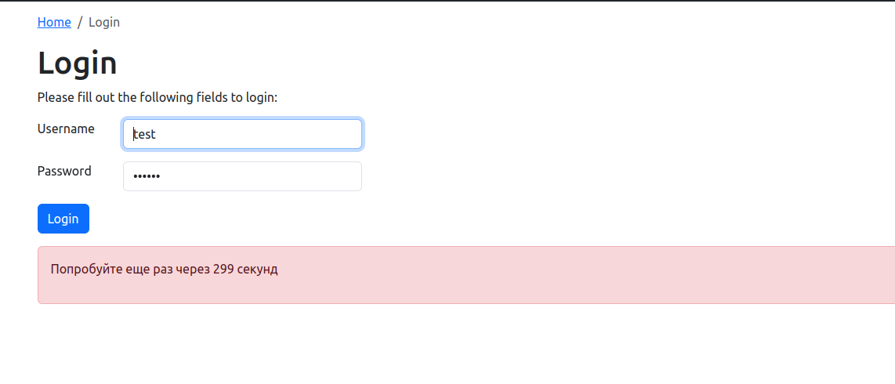
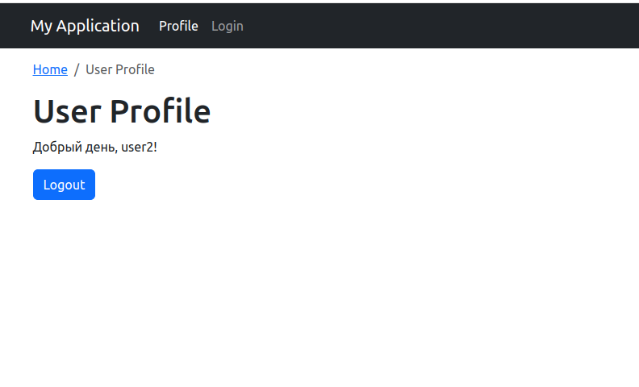

## Installation

1. Clone the repository:

git clone https://github.com/SergiiShcherbanCHI/login-test.git

2. Install Composer dependencies:

composer install

3. Run site

cd /path/to/project/web
php -S localhost:8000 -t web/

OR 
set up server Apache or Nginx use this instructions
https://github.com/yiisoft/yii2/blob/master/docs/guide-ru/start-installation.md

4. Test users

test,test

user2,password2

user3,password3

5. Screenshots

## Answers on questions

You will find answers to questions here [answers.txt](answers.txt)